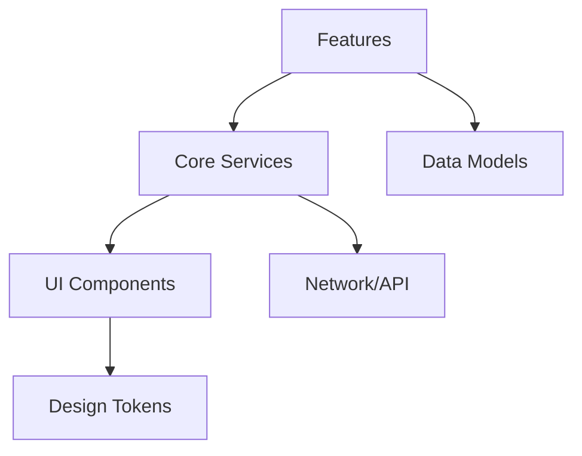

# [AppName] Wireframe Blueprint
_Version: 1.0.1 - YYYY-MM-DD_

> Template derived from the **Wimboom Build Blueprint**, refactored for reuse across projects.  
> Replace all bracketed variables `[AppName]`, `[Feature]`, `[Model]`, `[Service]`, etc.  
> Use comment tags for traceability (`<!--TASK:-->`, `<!--DEPENDENCY:-->`, `<!--SECTION:-->`).

---

## Purpose
<!--SECTION:purpose-->
This document provides a reusable foundation for planning, designing, and building new applications.  
It is intended for **founders, engineers, and AI coding agents** to align on:
- Core product goals  
- Technical architecture  
- Visual structure  
- Success metrics and QA  

Treat it as both a **wireframe and execution blueprint** - the single source of truth from idea to release.

---

## Quick-Start
<!--SECTION:quickstart-->
1. Copy this file to `/templates/`.  
2. Search and replace all `[AppName]` variables.  
3. Update `_Version_` and date at the top.  
4. Commit with tag `v1.0.1`.  
5. Run your bootstrap or CI setup (e.g., `make bootstrap && make test`).  
6. Extend with brand-specific overlay files (e.g., `wimboom_overlay.md`).  

---

## 1. Product Overview
<!--SECTION:product_overview-->
- **Product Name:** [AppName]  
- **Tagline:** [Short memorable phrase]  
- **Mission:** [What problem the app solves + unique value]  
- **MVP Goals:**  
  - [Goal 1]  
  - [Goal 2]  
- **Non-Goals:** [Out-of-scope features for MVP]

---

## 2. Personas & User Flows
<!--SECTION:personas-->
- **Primary Persona:** [Who + main goal]  
- **Secondary Persona:** [Who + goal]  
- **Macro Flow:**  
  1. [Step 1 - entry point]  
  2. [Step 2 - core action]  
  3. [Step 3 - success state]

---

## 3. Technical Stack
<!--SECTION:stack-->
| Layer | Tools / Frameworks | Notes |
|-------|--------------------|-------|
| Runtime | [Flutter / React Native / Web] |  |
| State | [Riverpod / Zustand / Redux] |  |
| Backend | [Supabase / Firebase / API] |  |
| CI/CD | [GitHub Actions / Codemagic] |  |

---

## 3.5 Core Feature Breakdown (Execution Plan)
<!--SECTION:feature_breakdown-->
This section translates the MVP Goals into executable tasks for the AI Agent. Each feature must map to a component and contain acceptance criteria.

### Feature 1: [Feature - e.g., User Onboarding]
- **Module:** `/features/onboarding`  
- **Goal:** Allow a new user to sign up and select initial preferences.  
- **Components Required:** `OnboardingScreen`, `PreferenceSelector`, `AuthForm`  
- **Acceptance Criteria (Example):**  
  **Scenario:** Successful Sign-Up  
  - **Given** I am on the `/onboarding` screen  
  - **When** I enter valid credentials and submit  
  - **Then** I am routed to `/home` and a `UserCreated` event is logged  

### Feature 2: [Feature - e.g., Core Data Feed]
- **Module:** `/features/feed`  
- **Goal:** Display the main list of content and support pull-to-refresh.  
- **Components Required:** `FeedScreen`, `FeedCard`, `LoadingSpinner`  
- **Acceptance Criteria (Example):**  
  **Scenario:** Loading Data  
  - **Given** I am on the `/home` screen and data is stale  
  - **When** the screen is loaded  
  - **Then** a `LoadingSpinner` is visible and a list of `FeedCards` appears after 1-3 seconds  

[Add Feature 3, 4, etc. as needed for MVP]

---

## 4. Repository & Project Setup
<!--SECTION:setup-->
- Folder structure (see Appendix A)  
- Linting + formatting rules  
- `.env` and secrets management  
- CI jobs: `analyze`, `test`, `build`, `deploy`

---

## 5. Visual Overview
<!--SECTION:visual_overview-->
### App Architecture Map (Mermaid)


### Navigation Tree
```
/onboarding -> /main
  -> /home
  -> /explore
  -> /downloads
  -> /settings
```

*(Replace or extend with app-specific flow diagrams.)*

---

## 6. Design System
<!--SECTION:design_system-->
<!--TASK:theme-->
- Theme tokens (colour, typography, spacing)  
- Components: `GlassPanel`, `GradientButton`, `IconPill`, etc.  
- Accessibility contrast >= 4.5 : 1  
<!--DEPENDENCY:google_fonts, flex_color_scheme-->

---

## 7. State & Data Models
<!--SECTION:data_models-->
- **Models:** `[User]`, `[Playlist]`, `[Track]`, `[Notification]`  
- **Sample Payloads:** stored under `/assets/mock/api`  
- **Serialization:** via `freezed` + `json_serializable`  
- **Storage:** Hive or local DB  
<!--DEPENDENCY:hive, freezed, json_serializable-->

---

## 7.5 API & Service Contract
<!--SECTION:api_contract-->
This defines the external interfaces for the data models, enabling the AI to build repositories and services.

- **Base URL:** `https://api.appname.com/v1`  
- **Authentication:** Bearer Token passed in Authorization header.  
- **Error Standard:** Standard 4xx/5xx HTTP codes. Error payloads must contain `{"code": 123, "message": "..."}`.  

| Endpoint (Method) | Path | Model Impacted | Required Data (Body) |
|-------------------|------|----------------|----------------------|
| `GET` | `/users/me` | [User] | None |
| `POST` | `/auth/signup` | [User] | `{email, password, name}` |
| `GET` | `/playlists/{id}` | [Playlist] | None |
| `PATCH` | `/playlists/{id}/rename` | [Playlist] | `{new_name}` |
| `DELETE` | `/tracks/{id}` | [Track] | None |

---

## 8. QA, Metrics & Testing
<!--SECTION:qa-->
### System Error States and Handling (NEW FOCUS)
The application must handle the following system-level failures gracefully:

| Error Type | UX Strategy | Logging Level |
|-------------|--------------|----------------|
| No Network | Persistent, dismissible banner at top of screen. Do not block interaction. | Warning |
| 401 Unauthorized | Clear local session and force user back to `/onboarding`. | Error |
| 5xx Server Error | Full-screen "Something went wrong" message with visible Retry button. | Critical |
| Local DB Corruption | Attempt non-destructive repair/clear. Notify user via in-app message. | Critical |

### Success Metrics
| KPI | Target | Verification |
|-----|---------|--------------|
| Cold start time | < 2.5 s (Android mid-tier) | Profile run |
| Crash-free sessions | > 99.5 % | Crashlytics dashboard |
| Retention (3 days) | > 90 % (MVP pilot) | Analytics cohort |
| Frame build time | < 16 ms | DevTools profile |

### Testing
- Unit > 80 % coverage  
- Golden tests for visual parity  
- Integration: onboarding + play + settings flow  
- Accessibility: screen-reader + text-scale + colour-blind simulation  

### Acceptance Checklist
- [ ] All screens load without crash  
- [ ] Offline mode functions correctly  
- [ ] Analytics events fire as expected  
- [ ] App meets performance thresholds  

---

## 9. Platform Compliance (iOS / Android)
<!--SECTION:platform_compliance-->
(Existing from previous version - App Store & Play Store guidelines.)

---

## 10. Future Enhancements (Prioritised)
<!--SECTION:enhancements-->
(Existing prioritised enhancement table.)

---

## 11. Traceability Example
<!--SECTION:traceability-->
(Existing traceability markdown example.)

---

## 12. Appendices
<!--SECTION:appendices-->
(Existing folder skeleton + design token examples.)

---

### Next Step
Save this as  
`/templates/wireframe_blueprint_v1.1.md`  
Then extend or override via brand-specific overlay files (e.g., `wimboom_overlay.md`).
